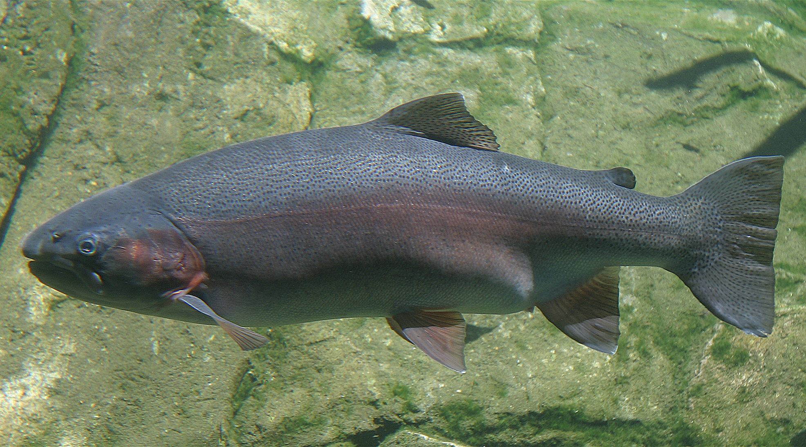

```{r setup, include=FALSE}
knitr::opts_chunk$set(echo = TRUE,
                      message = FALSE,
                      warning = FALSE,
                      fig.align = "center")

# Attach packages
library(tidyverse)
library(janitor)
library(here)
library(paletteer)
library(lubridate)
library(tsibble)
library(fable)
library(fabletools)
library(feasts)
library(forecast)

# Read in raw data
steelhead <- read_csv("cbr_fish_passage_bonneville_allyrs_steelhead.csv") %>% 
  clean_names()
```

### 1. Introduction

Bonneville Dam, located on the Columbia River, is one of the biggest hydroelectric systems in the world (Desiree Ramirez, 2019). However, the presence of dam would block the reproducing and rearing habitats of many fishes, including salmon and steelhead (Northwest Power and Conservation Council, 2015). To alleviate the negative effects on fish, Hatchery utilities were built in 1909 and renovated in 1957 and 1998 (Oregon Department of Fish & Wildlife, 2019). In this report, we will analysis and visualize time series data for adult steelhead salmon passage across the Bonneville Dam from 1939 - 2019.


```{r introPic2, out.width = "60%", fig.show='hold', fig.align='default', echo=FALSE}


```

***Figure. 1*** *Oncorhynchus mykiss (Steelhead) at the Oregon Zoo Picture by User: Cacophony, published on [Wikimedia Commons](https://commons.wikimedia.org/wiki/File:Steelhead.jpg).*


### 2. Data analysis

##### a. Daily data time series plot for adult steelhead passage

```{r sh_date}
# Combine the year, month and day and transform into date class in a new column

steelhead_date <- steelhead %>% 
  mutate(date = paste(year, mm_dd, sep = "-")) %>% 
  mutate(date_new = lubridate::ydm(date)) %>%
  drop_na(date_new) 
# remove NA date, normally unexisted date: for example Feb 29, 2019 didn't exist, it was transformed to NA

```


```{r daily_figure, fig.width=8, fig.height=4}
# Draw a daily passage line plot
ggplot(data = steelhead_date, aes(x = date_new, y = value))+
  geom_line(aes(color = year), show.legend = FALSE)+
  labs(x = "Date", y = "Adult passage number (fish/day)")+
  scale_color_paletteer_c("grDevices::rainbow")+
  theme_minimal()
```


***Figure. 2*** *Daily adult steelhead passage through Bonneville Dam. Different colors represent different years. Data source: Data from: Columbia Basin Research Available here: [Adult fish passage](http://www.cbr.washington.edu/dart/query/adult_graph_text).*

##### b. Seasonplot showing monthly passage variation 

```{r monthly_data}
# Put month and year in seprate columns
steelhead_parsed <- steelhead_date %>% 
  mutate(month = month(date_new, label = TRUE)) %>% 
  mutate(date_ym = yearmonth(date_new))


# Group and calcuate data for seasonal plot
steel_season <- steelhead_parsed %>% 
  group_by(year, month) %>% 
  summarize(
    monthly_total = sum(value, na.rm = TRUE)
  )


# Calculate the monthly total for tsibble
steel_monthly <- steelhead_parsed%>% 
  group_by(date_ym) %>% 
  summarize(
    monthly_total = sum(value, na.rm = TRUE)
  ) %>% 
  mutate(location = "Bon")

# convert the monthly table into tsibble format
steel_ts <- as_tsibble(steel_monthly, key = "location", index = "date_ym")
```

```{r seasonal_plot, fig.width=8, fig.height=4}
# Seasonal plot
ggplot(data = steel_season, aes(x = month, y = monthly_total, group = year))+
  geom_line(aes(color = year))+
  scale_color_paletteer_c("pals::kovesi.diverging_rainbow_bgymr_45_85_c67")+
  labs(x = "", y = "Monthly adult steelhead passage (fish/month)", color = "Year")+
  theme_minimal()
```

***Figure. 3*** *A seasonplot of adult steelhead passage across Bonneville Dam in different months for each year. The years present in different colors. From the past to the present, the color changes from blue to green, yellow and red. Data source: Data from: Columbia Basin Research Available here: [Adult fish passage](http://www.cbr.washington.edu/dart/query/adult_graph_text).*

We can see strong and consistent pattern of the monthly passage amount within one year. The annual peaks often occur in August. Summer to early fall (July to September) is the main migration season for steelhead in this area. Besides, the size of migration seemed to grow recently. Most monthly passage amounts after 2000 (lines in red color) were relatively higher than those before 2000 (lines in colors other than red), especially in peak months.

##### c. Annual steelhead passage graph

```{r annual_data}
# Calculate the annual total/yearly total
steel_year <- steelhead_date %>% 
  group_by(year) %>% 
  summarize(
    year_total = sum(value, na.rm = TRUE)
  ) 
```


```{r annual_plot, fig.width=8, fig.height=4}
# Make a bar graph for annual total
ggplot(data = steel_year, aes(x = year, y = year_total)) +
  geom_col(aes(fill = year), 
           width = 1, 
           color = "white",
           show.legend = FALSE)+
  scale_fill_paletteer_c("pals::kovesi.diverging_rainbow_bgymr_45_85_c67")+
  labs(x = "Year", 
       y = "Annual adult steelhead passage (fish/year)")+
  scale_x_continuous(breaks = c(1939, 1950, 1960, 1970, 1980, 1990, 2000, 2010, 2019))+
  theme_minimal()
```

***Figure. 4*** *Annual amount plot shows the fluctuation of the migration amounts during 1939-2019. Each column indicates the annual passage amount in the specific year. Data source: Data from: Columbia Basin Research Available here: [Adult fish passage](http://www.cbr.washington.edu/dart/query/adult_graph_text).*

According to the Oregon Department of Fish & Wildlife, fish protection facilities renovations were in 1957 and 1998. Because our data only includes adult fish passage, normally there would be a time lag between spawning and increasing whole population. In this annual plot, we could see a huge rise in 2001, which was three years later than the 1998 project. However, no visible improvement happened after the 1957 program.

##### d. Explore, decomposition and analysis the time series data

```{r fig.width=9}
# Decomposite the steelhead data
dcmp <- steel_ts %>% 
  model(STL(monthly_total ~ season(window = 3)))

# Plot each components of the steelhead data
components(dcmp) %>% autoplot() +
  labs(title = "STL Decomposition",
       subtitle = "Monthly passage = trend + season_year-month + remainder",
       x = "Date (year-month)")+
  theme_minimal()
```

***Figure. 5*** *Decomposition of the time series passage data during 1939-2019. Data source: Data from: Columbia Basin Research Available here: [Adult fish passage](http://www.cbr.washington.edu/dart/query/adult_graph_text).*

From the original data, we could see strong seasonality, no clearly overall trend and cyclical trend. Considering the peak months are from July to August, we choose 3 as the window width. The trend in decomposition plot catches the changes in the original graph. The seasonal also contains the yearly peak feature. Additionally, the residuals seem relatively random.

```{r acf}
# Use the autocorrelation function (ACF) to further examine the seasonality
steel_ts %>% 
  ACF(monthly_total) %>% 
  autoplot()+
  theme_minimal()
```

***Figure. 6*** *The autocorrelation function (ACF) of the time series passage data in 1939-2019. It shows the correlation of a time series data with itself. Data source: Columbia Basin Research Available here: [Adult fish passage](http://www.cbr.washington.edu/dart/query/adult_graph_text).*

We can observe strong seasonality in this data. For example, months 3-9 are positively correlated with each other. Positive correlation also happens in month 10-14. While these two group are negatively correlated.


### 3. References

- Columbia River DART, Columbia Basin Research, University of Washington. (2019). Adult Passage Graphics & Text. Available from http://www.cbr.washington.edu/dart/query/adult_graph_text

- Desiree Ramirez. (2019, November 19). Bonneville Dam. The Official Guide to Portland. https://www.travelportland.com/region/bonneville-dam/

- Oregon Department of Fish & Wildlife. (2019). Bonneville Hatchery Visitors’ Guide | Oregon Department of Fish & Wildlife. https://myodfw.com/bonneville-hatchery-visitors-guide

- Northwest Power and Conservation Council. (2015). Dams: Impacts on salmon and steelhead. https://www.nwcouncil.org/reports/columbia-river-history/damsimpacts
